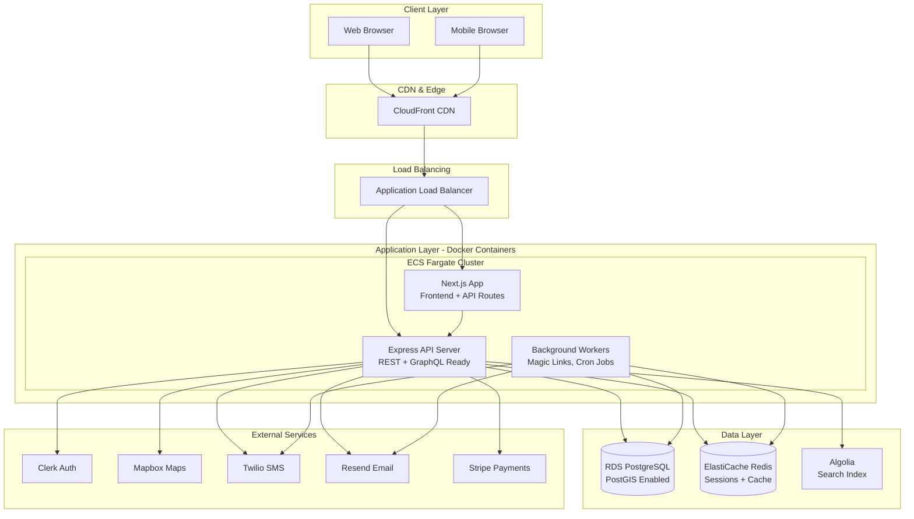

# BHC Connect - Enterprise Architecture & Development Plan

## Executive Summary

This plan outlines the architecture and development approach for BehavioralHealth Connect, an enterprise-grade B2B SaaS platform. The system will be built as a modular monolith with Docker containerization, designed for horizontal scaling and future microservices migration. Development follows a phased approach: Database → Auth → Provider Module → Clinician Module → Admin Module.

## Recommended Technology Stack

### Core Application

- **Frontend**: Next.js 14+ (App Router) with TypeScript
- **Backend API**: Node.js 20+ with Express.js (TypeScript)
- **UI Framework**: Tailwind CSS + shadcn/ui components
- **Database**: PostgreSQL 15+ with PostGIS extension (AWS RDS)
- **ORM**: Prisma (already defined in schema.prisma)
- **Cache**: Redis (ElastiCache) for sessions and query caching

### Authentication & Authorization

- **Primary**: Clerk (B2B SaaS optimized, quick setup, enterprise features)
- **Alternative Consideration**: NextAuth.js if custom requirements emerge
- **Rationale**: Clerk provides enterprise SSO, organization management, and role-based access out of the box

### Search Architecture (Hybrid Approach)

- **Geospatial Search**: PostgreSQL + PostGIS for radius queries and distance calculations
- **Full-Text & Faceting**: Algolia for fast multi-filter search, faceted navigation, and typo tolerance
- **Rationale**: PostGIS handles complex geospatial queries efficiently, while Algolia provides sub-100ms search with advanced filtering

### Infrastructure & Deployment

- **Primary**: AWS ECS Fargate (serverless containers, auto-scaling)
- **Alternative**: AWS EKS if Kubernetes expertise available
- **Database**: AWS RDS PostgreSQL (Multi-AZ for high availability)
- **Cache**: AWS ElastiCache Redis
- **Load Balancer**: Application Load Balancer (ALB)
- **CDN**: CloudFront for static assets
- **Container Registry**: Amazon ECR

### Supporting Services

- **Maps**: Mapbox GL JS (better pricing than Google Maps for high volume)
- **Email**: Resend or SendGrid (transactional emails)
- **SMS**: Twilio (for magic link SMS delivery)
- **Payments**: Stripe (subscription management)
- **Monitoring**: AWS CloudWatch + Sentry (error tracking)
- **Logging**: CloudWatch Logs with structured logging

## Architecture Overview

### System Architecture Diagram



### Application Architecture (Modular Monolith)

```
src/
├── app/                    # Next.js App Router
│   ├── (auth)/            # Auth routes (login, register)
│   ├── (clinician)/       # Clinician portal routes
│   ├── (provider)/        # Provider portal routes
│   ├── (admin)/           # Admin portal routes
│   └── api/               # API routes (Next.js API)
├── server/                # Express API server
│   ├── modules/
│   │   ├── auth/          # Authentication module
│   │   ├── provider/     # Provider management
│   │   ├── clinician/    # Clinician features
│   │   ├── admin/        # Admin features
│   │   ├── search/       # Search service
│   │   ├── notifications/ # Email/SMS
│   │   └── analytics/     # Analytics & reporting
│   ├── shared/
│   │   ├── db/           # Prisma client
│   │   ├── cache/        # Redis client
│   │   ├── events/       # Event bus (in-process, ready for queue)
│   │   └── middleware/    # Auth, validation, rate limiting
│   └── workers/           # Background jobs
│       ├── magic-links/   # Magic link scheduler
│       └── sync/          # Algolia sync worker
└── shared/                # Shared types, utils
    ├── types/            # TypeScript types
    ├── constants/        # Enums, constants
    └── utils/            # Utility functions
```

## Docker Architecture

### Container Strategy

**Multi-container approach with Docker Compose for local development:**

```yaml
services:
  nextjs:
    build: ./apps/web
    ports: ["3000:3000"]
    environment:
   - DATABASE_URL
   - REDIS_URL
   - ALGOLIA_API_KEY
    depends_on: [api]
  
  api:
    build: ./apps/api
    ports: ["4000:4000"]
    environment:
   - DATABASE_URL
   - REDIS_URL
    depends_on: [db, redis]
  
  worker:
    build: ./apps/worker
    environment:
   - DATABASE_URL
   - REDIS_URL
    depends_on: [db, redis]
  
  db:
    image: postgis/postgis:15-3.3
    volumes: [postgres_data:/var/lib/postgresql/data]
    environment:
   - POSTGRES_PASSWORD
  
  redis:
    image: redis:7-alpine
    volumes: [redis_data:/data]
```

**Production**: Each service runs as separate ECS tasks with auto-scaling policies.

## Development Phases

### Phase 1: Foundation & Database (Weeks 1-2)

**Deliverables:**

- Database setup with PostGIS extension
- Prisma schema implementation and migrations
- Database seeding scripts
- Docker Compose setup for local development
- CI/CD pipeline foundation

**Tasks:**

1. Set up RDS PostgreSQL with PostGIS extension
2. Configure Prisma with all models from schema.prisma
3. Create initial migrations
4. Set up database connection pooling
5. Create seed scripts for development data
6. Docker Compose configuration
7. GitHub Actions CI/CD pipeline

**Files to Create:**

- `docker-compose.yml` - Local development environment
- `prisma/migrations/` - Database migrations
- `prisma/seed.ts` - Seed script
- `.github/workflows/ci.yml` - CI pipeline
- `apps/api/Dockerfile` - API container
- `apps/web/Dockerfile` - Next.js container

### Phase 2: Authentication & Registration (Weeks 3-4)

**Deliverables:**

- Clerk integration
- User registration flows (Clinician, Provider)
- Email verification
- Role-based access control
- Session management

**Tasks:**

1. Integrate Clerk authentication
2. Build registration flows matching mockups:

                                                                                                - Clinician registration (3-step)
                                                                                                - Provider registration (3-step)

3. Email verification system
4. Organization domain verification
5. RBAC middleware
6. Protected route components
7. User profile management

**Key Files:**

- `apps/web/app/(auth)/register-clinician/page.tsx`
- `apps/web/app/(auth)/register-provider/page.tsx`
- `apps/web/app/(auth)/login/page.tsx`
- `server/modules/auth/auth.service.ts`
- `server/modules/auth/auth.middleware.ts`

### Phase 3: Provider Portal (Weeks 5-8)

**Deliverables:**

- Provider dashboard with bed availability widget
- Profile management (edit profile page)
- Bed availability management
- Magic link system for passwordless updates
- Provider settings

**Tasks:**

1. Provider dashboard implementation
2. Bed availability CRUD operations
3. Magic link token generation and validation
4. Scheduled magic link delivery (cron job)
5. SMS integration (Twilio)
6. Email templates for magic links
7. Profile editor with all fields from schema
8. Settings page (magic link preferences)

**Key Features:**

- Auto-save bed availability updates
- Touch-friendly +/- buttons
- Last updated timestamps
- Status indicators (Available/Limited/Full)
- Magic link expiration logic (48h or on-use)

**Key Files:**

- `apps/web/app/(provider)/dashboard/page.tsx`
- `apps/web/app/(provider)/edit-profile/page.tsx`
- `apps/web/app/(provider)/settings/page.tsx`
- `apps/web/app/update-beds/[token]/page.tsx` - Public magic link page
- `server/modules/provider/provider.service.ts`
- `server/modules/provider/bed-availability.service.ts`
- `server/modules/notifications/magic-link.service.ts`
- `server/workers/magic-links/scheduler.ts`

### Phase 4: Clinician Portal (Weeks 9-12)

**Deliverables:**

- Advanced search with geospatial filtering
- Search results page with map integration
- Provider detail pages
- Saved facilities with tags and notes
- Contact log system
- Review and rating system

**Tasks:**

1. Search service implementation:

                                                                                                - PostGIS geospatial queries
                                                                                                - Algolia integration for full-text search
                                                                                                - Hybrid search combining both

2. Search results page with filters
3. Map integration (Mapbox)
4. Provider detail page (all tabs)
5. Saved providers functionality
6. Contact log CRUD
7. Review submission and moderation
8. Follow-up reminders

**Key Features:**

- Radius-based search (5-100 miles)
- Multi-filter search (insurance, level of care, demographics)
- Real-time bed availability display
- Map/list toggle
- Infinite scroll pagination
- Sort by distance, rating, recently updated

**Key Files:**

- `apps/web/app/(clinician)/dashboard/page.tsx`
- `apps/web/app/(clinician)/search/page.tsx`
- `apps/web/app/(clinician)/providers/[id]/page.tsx`
- `apps/web/app/(clinician)/saved/page.tsx`
- `apps/web/app/(clinician)/contact-log/page.tsx`
- `server/modules/search/search.service.ts`
- `server/modules/search/geospatial.service.ts`
- `server/modules/clinician/saved-providers.service.ts`
- `server/modules/clinician/contact-log.service.ts`
- `server/modules/reviews/review.service.ts`

### Phase 5: Admin Portal (Weeks 13-14)

**Deliverables:**

- Admin dashboard with platform metrics
- Provider verification queue
- User management
- Analytics dashboard
- Review moderation

**Tasks:**

1. Admin dashboard with key metrics
2. Provider verification workflow
3. User management (CRUD, role assignment)
4. Analytics queries and charts
5. Review moderation interface
6. Platform-wide settings

**Key Files:**

- `apps/web/app/(admin)/dashboard/page.tsx`
- `apps/web/app/(admin)/providers/page.tsx`
- `apps/web/app/(admin)/users/page.tsx`
- `apps/web/app/(admin)/analytics/page.tsx`
- `server/modules/admin/verification.service.ts`
- `server/modules/admin/analytics.service.ts`

### Phase 6: Testing, Optimization & Deployment (Weeks 15-16)

**Deliverables:**

- Comprehensive test coverage
- Performance optimization
- Production deployment
- Monitoring and logging setup

**Tasks:**

1. Unit tests (Jest)
2. Integration tests
3. E2E tests (Playwright)
4. Performance optimization:

                                                                                                - Database query optimization
                                                                                                - Redis caching strategy
                                                                                                - CDN configuration
                                                                                                - Image optimization

5. Security audit
6. Production deployment to AWS
7. Monitoring setup (CloudWatch, Sentry)
8. Documentation

## Infrastructure Setup

### AWS Resources

1. **VPC**: Custom VPC with public/private subnets
2. **RDS**: PostgreSQL 15 with PostGIS (Multi-AZ)
3. **ECS**: Fargate cluster with auto-scaling
4. **ElastiCache**: Redis cluster
5. **ALB**: Application Load Balancer with SSL
6. **CloudFront**: CDN for static assets
7. **ECR**: Container registry
8. **Secrets Manager**: Environment variables and API keys
9. **CloudWatch**: Logging and monitoring
10. **Route 53**: DNS management

### Auto-Scaling Configuration

- **ECS Service Auto-Scaling**: Based on CPU (70%) and memory (80%)
- **Target Tracking**: Maintain 50% CPU utilization
- **Min Tasks**: 2 (high availability)
- **Max Tasks**: 10 (cost control)
- **Scaling Cooldown**: 60 seconds

### Security Considerations

- All containers run in private subnets
- ALB in public subnet with SSL termination
- RDS in private subnet, no public access
- Secrets stored in AWS Secrets Manager
- WAF rules on ALB for DDoS protection
- Rate limiting on API endpoints
- CORS configuration
- Input validation on all endpoints

## Database Strategy

### PostGIS Setup

```sql
-- Enable PostGIS extension
CREATE EXTENSION IF NOT EXISTS postgis;

-- Create spatial index on provider locations
CREATE INDEX idx_providers_location_gist 
ON providers USING GIST (location);
```

### Connection Pooling

- Use PgBouncer or Prisma connection pooling
- Configure pool size: min 5, max 20 per instance
- Connection timeout: 10 seconds

### Migration Strategy

- Prisma migrations for schema changes
- Zero-downtime migrations using blue-green deployment
- Backup before each migration

## Search Architecture Details

### Hybrid Search Approach

1. **Geospatial Filtering (PostGIS)**:

                                                                                                - Filter providers within radius
                                                                                                - Calculate distances
                                                                                                - Sort by distance

2. **Full-Text & Faceting (Algolia)**:

                                                                                                - Index provider data (name, description, specialties)
                                                                                                - Faceted search (insurance, level of care, demographics)
                                                                                                - Typo tolerance and relevance ranking

3. **Combination Strategy**:

                                                                                                - Use PostGIS to get candidate providers within radius
                                                                                                - Use Algolia to rank and filter by other criteria
                                                                                                - Merge results with distance calculations

### Algolia Index Structure

```typescript
{
  objectID: "provider_id",
  name: "Facility Name",
  city: "Boston",
  state: "MA",
  levelsOfCare: ["RESIDENTIAL", "PHP"],
  insuranceAccepted: ["BCBS", "Aetna"],
  specialties: ["SUBSTANCE_ABUSE", "DUAL_DIAGNOSIS"],
  averageRating: 4.5,
  totalReviews: 23,
  availabilityStatus: "AVAILABLE",
  _geoloc: { lat: 42.3601, lng: -71.0589 }
}
```

## Magic Link System Architecture

### Token Generation

- Cryptographically secure: 64-character hex string
- Stored in `bed_update_tokens` table
- Expires: 48 hours OR on first use (whichever first)

### Delivery System

1. **Scheduler Service** (runs every hour):

                                                                                                - Query providers with `magicLinkEnabled = true`
                                                                                                - Check if last update > 24 hours
                                                                                                - Generate token
                                                                                                - Send email/SMS based on provider preferences

2. **Update Page** (public, no auth):

                                                                                                - Validate token
                                                                                                - Check expiration
                                                                                                - Display simple update form
                                                                                                - Update bed counts
                                                                                                - Mark token as used
                                                                                                - Log IP address and user agent

### Security Measures

- Rate limiting: 5 requests per IP per hour
- IP logging for audit trail
- Email notification to provider on update
- Token invalidation on use

## Event-Driven Architecture (Future-Ready)

### In-Process Event Bus

Start with simple in-process events, ready to migrate to message queue:

```typescript
// Event types
- bed_availability_updated
- provider_verified
- review_submitted
- contact_logged
- user_registered

// Event handlers
- Update Algolia index
- Send notifications
- Update analytics
- Trigger webhooks (future)
```

**Future Migration**: Replace with SQS/SNS or RabbitMQ when needed.

## Performance Optimization

### Caching Strategy

1. **Redis Caching**:

                                                                                                - Provider profiles: 5-minute TTL
                                                                                                - Search results: 2-minute TTL
                                                                                                - User sessions: 24-hour TTL
                                                                                                - Bed availability: 1-minute TTL (critical for freshness)

2. **CDN Caching**:

                                                                                                - Static assets: 1-year TTL
                                                                                                - API responses: No cache (dynamic data)

3. **Database Optimization**:

                                                                                                - Index all foreign keys
                                                                                                - Composite indexes for common queries
                                                                                                - Query optimization and EXPLAIN analysis

### Database Indexes (Critical)

From schema.prisma, ensure these indexes exist:

- `providers.location` (GIST index for PostGIS)
- `providers.verificationStatus`
- `bed_availability.providerId`
- `bed_availability.status`
- `reviews.providerId`
- `saved_providers.clinicianId`

## Testing Strategy

### Unit Tests

- Service layer functions
- Utility functions
- Business logic validation

### Integration Tests

- API endpoints
- Database operations
- External service integrations (mocked)

### E2E Tests

- Critical user flows:
                                                                - Registration → Login → Dashboard
                                                                - Provider: Update beds → Magic link
                                                                - Clinician: Search → View provider → Save → Log contact

### Test Coverage Target

- Unit tests: >80% coverage
- Integration tests: All API endpoints
- E2E tests: Critical user journeys

## Monitoring & Observability

### Metrics to Track

1. **Application Metrics**:

                                                                                                - Request latency (p50, p95, p99)
                                                                                                - Error rate
                                                                                                - API endpoint usage
                                                                                                - Search query performance

2. **Business Metrics**:

                                                                                                - Daily active users
                                                                                                - Bed update compliance rate
                                                                                                - Search-to-contact conversion
                                                                                                - Provider verification time

3. **Infrastructure Metrics**:

                                                                                                - CPU/Memory utilization
                                                                                                - Database connection pool usage
                                                                                                - Redis cache hit rate
                                                                                                - Container scaling events

### Logging Strategy

- Structured logging (JSON format)
- Log levels: ERROR, WARN, INFO, DEBUG
- Centralized in CloudWatch Logs
- Error tracking in Sentry

## Deployment Strategy

### Environments

1. **Development**: Local Docker Compose
2. **Staging**: ECS Fargate (single instance)
3. **Production**: ECS Fargate (auto-scaling)

### Deployment Process

1. **CI Pipeline** (GitHub Actions):

                                                                                                - Run tests
                                                                                                - Build Docker images
                                                                                                - Push to ECR
                                                                                                - Run database migrations (staging/prod)

2. **CD Pipeline**:

                                                                                                - Blue-green deployment
                                                                                                - Health checks
                                                                                                - Rollback on failure
                                                                                                - Zero-downtime migrations

### Rollback Strategy

- Keep previous container image version
- Automated rollback on health check failure
- Database migration rollback scripts

## Cost Optimization

### Estimated Monthly Costs (AWS)

- **RDS**: $150-300 (db.t3.medium, Multi-AZ)
- **ECS Fargate**: $100-400 (2-4 tasks, auto-scaling)
- **ElastiCache**: $50-100 (cache.t3.micro)
- **ALB**: $20-30
- **CloudFront**: $10-50 (based on traffic)
- **Data Transfer**: $20-50
- **Total**: ~$350-930/month (scales with usage)

### Cost Optimization Tips

- Use Reserved Instances for RDS (1-year commitment)
- Implement aggressive caching to reduce database load
- Use CloudFront for static assets
- Monitor and optimize container resource allocation
- Archive old logs to S3 Glacier

## Security Checklist

- [ ] HTTPS everywhere (SSL certificates)
- [ ] Environment variables in Secrets Manager
- [ ] Input validation on all endpoints
- [ ] SQL injection prevention (Prisma parameterized queries)
- [ ] XSS protection (React auto-escaping)
- [ ] CSRF protection
- [ ] Rate limiting on API endpoints
- [ ] Authentication on all protected routes
- [ ] Role-based access control
- [ ] Audit logging for sensitive operations
- [ ] Regular security updates
- [ ] Penetration testing before launch

## Future-Proofing Considerations

### EHR Integration Ready

- Abstraction layer for bed update methods
- Webhook system architecture
- API versioning from day 1
- Event-driven architecture foundation

### Scalability Path

1. **Phase 1 (MVP)**: Modular monolith
2. **Phase 2 (Growth)**: Extract search service
3. **Phase 3 (Scale)**: Extract notification service
4. **Phase 4 (Enterprise)**: Full microservices

### Multi-Tenancy Support

- Organization-based data isolation
- Feature flags per organization
- Custom branding (future)

## Success Criteria

### Technical Metrics

- Search latency <500ms (p95)
- Page load <2s (p95)
- Uptime >99.9%
- Zero critical security vulnerabilities

### Business Metrics

- 100+ active providers
- 500+ monthly active clinicians
- 80% daily bed update compliance
- $50K MRR by Month 12

## Risk Mitigation

1. **Database Performance**: Regular query optimization, connection pooling
2. **Search Latency**: Hybrid approach, aggressive caching
3. **Magic Link Abuse**: Rate limiting, IP logging, token expiration
4. **Scaling Issues**: Auto-scaling policies, load testing
5. **Data Loss**: Automated backups, Multi-AZ RDS

## Documentation Requirements

- API documentation (OpenAPI/Swagger)
- Database schema documentation
- Deployment runbooks
- Architecture decision records (ADRs)
- Developer onboarding guide
- User documentation (help center)

---

## Next Steps

1. Review and approve this architecture plan
2. Set up AWS accounts and initial infrastructure
3. Initialize project structure
4. Begin Phase 1: Database setup
5. Weekly progress reviews and adjustments

This plan provides a solid foundation for building an enterprise-grade, scalable platform while maintaining flexibility for future growth and feature additions.